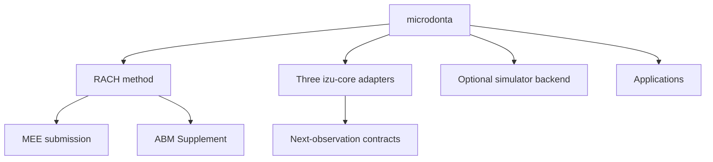

# Repository map

Status: Graphify 0.9.48 cleanup plus the 23-repository ownership audit,
2026-08-24.

This is microdonta's physical architecture. Portfolio-wide ownership is recorded
separately in `docs/repository_ecosystem.md` and
`repository_ecosystem.json`.

## Physical topology



| Physical root | Role | Installed with `rach` | Primary-paper evidence |
|---|---|---:|---:|
| `causal_model/` | RACH method, theorem projection, validation, ABM interfaces | yes | selected modules only |
| `paper/` | canonical manuscript and submission manifest | no | yes |
| `examples/campanula_izu/` | prospective observation-design example | no | prospective use only |
| `examples/island_pollination_translation/` | three izu-core-to-RACH adapter contracts | no | no |
| `attraction_trait_model/` | optional biological simulator backend | yes | no |
| `apps/` | interactive interfaces | no | no |
| `legacy/`, `*/archive/` | historical record | no | no |

The exact path registry is `repository_programs.json`; CI checks it with
`scripts/check_repository_boundaries.py`.

## Graphify diagnosis and final consolidation

Before the cleanup, `causal_model/` contained the independent eco-genetic
criticality programme. Its `DynamicsParameters` object was the largest
whole-repository hub, even though eco-genetic criticality already had a canonical
external repository.

The first Graphify pass separated that cluster into a local namespace. The
portfolio audit then detected that the namespace still duplicated the external
implementation. The final action is therefore stronger: current eco-genetic
code, documents, examples, and tests are absent from microdonta and owned only by
`zuizui0223/eco-genetic-criticality`.

| RACH code-only measure | Before separation | After separation |
|---|---:|---:|
| Python files | 88 | 74 |
| Nodes | 1,778 | 1,425 |
| Edges | 3,359 | 2,707 |
| Communities | 84 | 69 |
| Import cycles | 0 | 0 |

Removing the external mirror does not reduce the RACH counts further because the
separated cluster was already outside `causal_model`; it removes cross-repository
duplication and the extra in-repository programme entirely.

## Boundary rules

1. `causal_model` owns RACH and cannot import or copy eco-genetic criticality.
2. `zuizui0223/eco-genetic-criticality` is the sole owner of the criticality,
   fragmentation, and genetic-warning parent implementation.
3. `examples/island_pollination_translation/` contains exactly three adapters:
   signed position, effective service, and the complete response chain.
4. Adapters carry gates and forbidden shortcuts; they do not import izu-core or
   promote its synthetic results into empirical claims.
5. `attraction_trait_model` may support optional simulations, but its output is
   not manuscript evidence by default.
6. Applications stay under `apps/` and do not define scientific APIs.
7. Manuscript claims are governed by `paper/submission_manifest.json`, not by
   the mere presence of a module.

Run:

```bash
python scripts/check_repository_boundaries.py
python paper/check_submission_bundle.py
pytest -q
```
