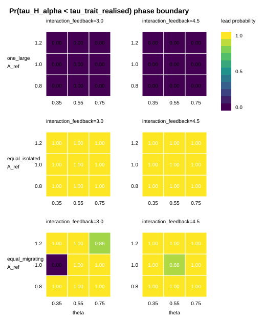

# H_alpha lead-probability phase boundary

This is a model-specific phase-boundary pilot, not a theorem and not an ecosystem projection.
Campanula mapping is deliberately deferred until the mathematical conclusions are sharper.



## Design

- landscapes: one_large, equal_isolated, equal_migrating under fixed total area
- panel columns: `interaction_feedback`, the extended simulator parameter
- panel x-axis: `theta`
- panel y-axis: `A_ref`
- color: `Pr(tau_H_alpha < tau_trait_realised)` among valid event pairs
- censoring: rows without valid event pairs are not converted into no-lead evidence

## Interpretation discipline

`interaction_feedback` is not the canonical logistic theorem parameter `kappa`.
The figure is therefore evidence about the declared extended closure, not a proof of the canonical threshold.

The plotted quantity connects H1-H3 only as a simulation witness:

```text
fixed total area landscape -> interaction/occupancy dynamics -> Pr(tau_H_alpha < tau_trait_realised)
```

It keeps the key non-equivalence explicit:

```text
Omega_tau^potential != realised N_H > 0 != p > 0 != H_alpha > 0
```

## Witness cells

- strongest H_alpha lead row: `equal_isolated`, A_ref=0.8, interaction_feedback=3.0, theta=0.35, Pr=1.000
- severe fragmented cell: `equal_isolated`, A_ref=1.2, interaction_feedback=4.5, theta=0.75, Pr=1.000
