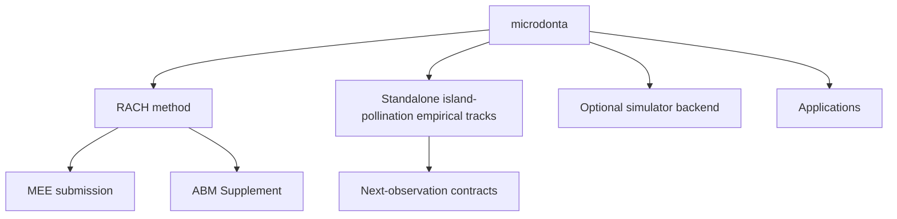

# Repository map

Status: current microdonta programme boundary, 2026-08-25.

This document describes microdonta's physical architecture. Portfolio-wide ownership is recorded separately in `docs/repository_ecosystem.md` and `repository_ecosystem.json`.

## Physical topology



| Physical root | Role | Installed with `rach` | Primary-paper evidence |
|---|---|---:|---:|
| `causal_model/` | RACH method, theorem projection, validation, ABM interfaces | yes | selected modules only |
| `paper/` | canonical MEE manuscript and submission manifest | no | yes |
| `examples/campanula_izu/` | prospective observation-design example | no | prospective use only |
| `examples/island_pollination_empirical_tracks/` | standalone island-pollination empirical observation-design programme | no | no |
| `attraction_trait_model/` | optional biological simulator backend | yes | no |
| `apps/` | interactive interfaces | no | no |
| `legacy/`, `*/archive/` | historical record | no | no |

The exact path registry is `repository_programs.json`; CI checks it with `scripts/check_repository_boundaries.py`.

## Boundary rules

1. `causal_model` owns RACH and cannot import or copy eco-genetic criticality.
2. `zuizui0223/eco-genetic-criticality` is the sole owner of that external criticality programme.
3. `examples/island_pollination_empirical_tracks/` contains exactly three standalone empirical tracks: signed functional position, effective service, and the complete response chain.
4. Those tracks are owned by microdonta, carry their own gates and forbidden shortcuts, and have no external manuscript or repository dependency.
5. They do not function as evidence for the MEE methods paper unless separately admitted through the paper's own submission manifest.
6. `attraction_trait_model` may support optional simulations, but its output is not manuscript evidence by default.
7. Applications stay under `apps/` and do not define scientific APIs.
8. Manuscript claims are governed by `paper/submission_manifest.json`, not by the mere presence of a module.

Run:

```bash
python scripts/check_repository_boundaries.py
python paper/check_submission_bundle.py
pytest -q
```

## Separation rule

The island-pollination empirical programme must remain semantically and mechanically self-contained. Current code, state files, documentation, tests, and registry entries must not require an external paper to define track readiness or scientific priority. Historical provenance remains available through Git history only.
