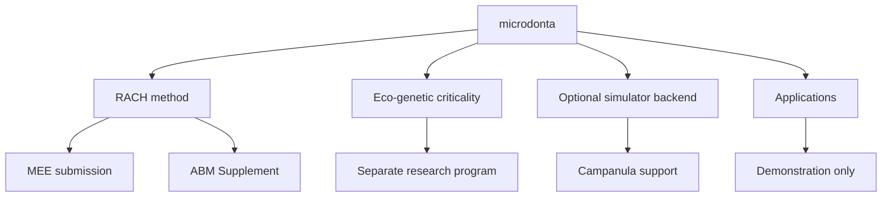

# Repository map

Status: Graphify 0.9.48 code graph, 2026-08-24.

This is the repository architecture map. The narrower manuscript claim graph is
maintained separately in `docs/publication_claim_graph.md`.

## Program topology



| Physical root | Role | Installed with `rach` | Primary-paper evidence |
|---|---|---:|---:|
| `causal_model/` | RACH method, theorem projection, validation, ABM interfaces | yes | selected modules only |
| `paper/` | canonical manuscript and submission manifest | no | yes |
| `examples/campanula_izu/` | prospective observation-design example | no | prospective use only |
| `eco_genetic_criticality/` | criticality, fragmentation, genetic-lag program | no | no |
| `attraction_trait_model/` | optional biological simulator backend | yes | no |
| `apps/` | interactive interfaces | no | no |
| `legacy/`, `*/archive/` | historical record | no | no |

The exact path registry is `repository_programs.json`; CI checks it with
`scripts/check_repository_boundaries.py`.

## Graphify diagnosis and change

The publication-reorganisation branch was first graphed as-is. Its
`causal_model/` package still contained the independent eco-genetic program, so
the largest architectural hub was `DynamicsParameters` from the multipatch
criticality model rather than a RACH abstraction.

The independent cluster was moved, without changing its code history, into the
top-level `eco_genetic_criticality` package with matching documentation,
examples, and tests. The Streamlit entry point moved from the repository root to
`apps/`.

| Graphify code-only measure for `causal_model/` | Before | After | Change |
|---|---:|---:|---:|
| Python files | 88 | 74 | −15.9% |
| Nodes | 1,778 | 1,425 | −19.9% |
| Edges | 3,359 | 2,707 | −19.4% |
| Communities | 84 | 69 | −17.9% |
| Import cycles | 0 | 0 | unchanged |
| Dangling, self-loop, or duplicate edges | 0 | 0 | unchanged |

The post-split RACH graph is now led by `PopulationState`,
`causal_resolvability()`, `BiologicalSwitch`, and `SweepRecord`. The independent
criticality graph remains queryable in the same repository, but its node IDs and
paths are explicitly namespaced under `eco_genetic_criticality`.

## Boundary rules

1. `causal_model` must not import `eco_genetic_criticality`.
2. `eco_genetic_criticality` is tested in place but excluded from the RACH wheel.
3. `attraction_trait_model` may support optional/prospective simulations, but its
   output is not manuscript evidence by default.
4. applications stay under `apps/` and do not define scientific APIs.
5. manuscript claims are governed by `paper/submission_manifest.json`, not by
   the mere presence of a code module.

Run:

```bash
python scripts/check_repository_boundaries.py
python paper/check_submission_bundle.py
pytest -q
```
